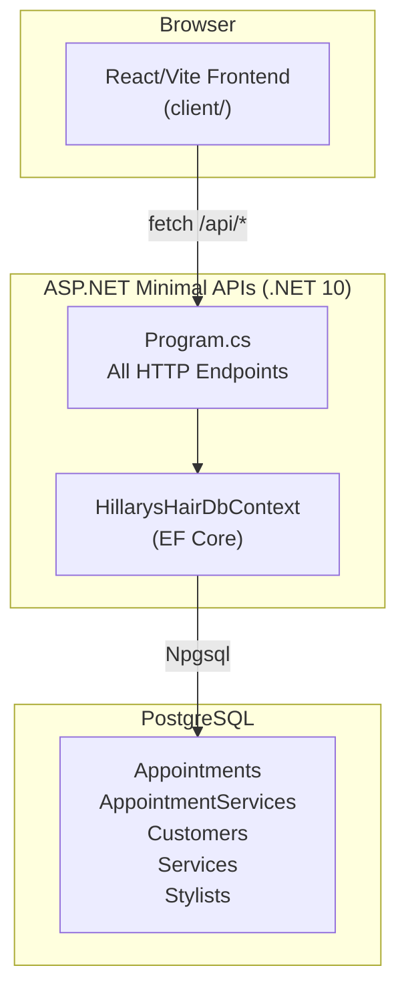
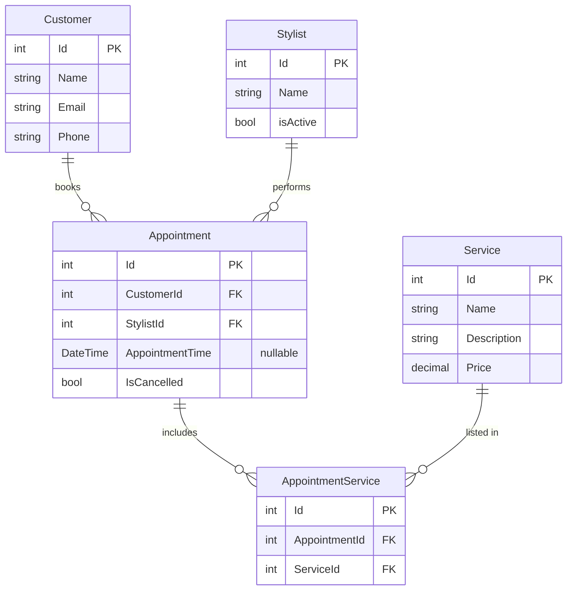

<!-- Last updated: 2026-06-11 -->
<!-- Last change: Added React Bootstrap as UI component library -->

# Hillary's Hair Care - Technical Architecture

## System Overview

Hillary's Hair Care is a salon management web app. Hillary (the salon owner) uses it to book appointments, manage customers, stylists, and services. There is no authentication; it is an internal tool used by one person.



Vite proxies all `/api` requests from the React dev server to `https://localhost:5001` (the .NET dev server). No CORS configuration is needed in development.

## Codebase Map

```
HillarysHairCare/
├── Program.cs                         # App entry point; all API endpoints go here (none yet)
├── HillarysHairDbContext.cs           # EF Core DbContext: DbSets + all seed data
├── HillarysHairCare.csproj            # .NET 10 project; NuGet deps (EF Core, Npgsql, OpenAPI)
├── appsettings.Development.json       # Logging config; connection string lives in user secrets
├── Models/
│   ├── Appointment.cs                 # Booking: links Customer + Stylist, time + cancellation flag
│   ├── AppointmentService.cs          # Join table row: one Appointment <-> one Service
│   ├── Customer.cs                    # Salon client: name, email, phone
│   ├── Service.cs                     # Menu item: name, description, price
│   ├── Stylist.cs                     # Staff member: name, active flag
│   └── DTOs/
│       ├── AppointmentDTO.cs          # ⚠ Uses raw Customer/Stylist types (needs fix before use)
│       ├── AppointmentServiceDTO.cs   # ⚠ Uses raw Appointment/Service types (needs fix before use)
│       ├── CustomerDTO.cs             # Correct: references List<AppointmentDTO>
│       ├── ServiceDTO.cs              # Correct: flat projection of Service
│       └── StylistDTO.cs             # Correct: references List<AppointmentDTO>
├── Migrations/
│   └── [3 migration files]            # EF Core migrations; database already created and seeded
└── client/                            # React/Vite frontend
    ├── vite.config.js                 # Proxy: /api -> https://localhost:5001
    ├── package.json                   # React 19, react-router-dom v7, react-bootstrap, Vite 8
    ├── index.html                     # HTML shell; mounts React into #root
    └── src/
        ├── main.jsx                   # React entry point; renders <App /> into #root
        ├── App.jsx                    # Root component; defines routes (not yet built out)
        ├── components/                # One component per feature view (not yet created)
        └── data/                      # Data manager modules: all fetch calls live here
            ├── appointments.js        # getAppointments, getAppointment, createAppointment, etc.
            ├── customers.js           # getCustomers, createCustomer
            ├── stylists.js            # getStylists, createStylist, deactivateStylist
            └── services.js            # getServices, createService
```

## Entry Points

**Backend:** `Program.cs` calls `WebApplication.CreateBuilder(args)`. The DI container registers `HillarysHairDbContext` with a Npgsql connection string from .NET user secrets (`HillarysHairDbConnectionString`). `AppContext.SetSwitch("Npgsql.EnableLegacyTimestampBehavior", true)` lets `DateTime` values work without timezone data. All 12 API endpoints belong in this file, after `var app = builder.Build()` and before `app.Run()`.

**Frontend:** `client/src/main.jsx` mounts `<App />` into `#root`. Still at the Vite default template; routing and all feature components need to be built.

## Component Breakdown

### Backend

| Component | File | Responsibility |
|-----------|------|----------------|
| Entry point | `Program.cs` | Bootstrap, DI wiring, all HTTP endpoints |
| DbContext | `HillarysHairDbContext.cs` | EF Core gateway to PostgreSQL; all `DbSet`s; seed data |
| Models | `Models/*.cs` | EF Core entity classes; map directly to DB tables |
| DTOs | `Models/DTOs/*.cs` | Response shapes; projected in LINQ `Select()`; never return raw models from endpoints |

### Frontend

Not yet built beyond the Vite boilerplate. `react-router-dom` is already installed. All 12 features will need a route, a component, and a data manager function.

The frontend is split into two layers:

- **`src/data/`** - Data manager modules. Each file groups the `fetch` calls for one resource (appointments, customers, stylists, services). Components never call `fetch` directly; they import and call functions from these modules instead. This keeps network logic in one place and components focused on rendering.
- **`src/components/`** - Feature components. Each component receives data (via props or local state populated by a data manager call) and handles user interaction.

## Data Model

Four entities and one join table.

| Table | Key Columns | Notes |
|-------|-------------|-------|
| `Stylists` | `Id`, `Name`, `isActive` | Soft-deactivated; historical appointments preserved |
| `Customers` | `Id`, `Name`, `Email`, `Phone` | Never deleted |
| `Services` | `Id`, `Name`, `Description`, `Price` (decimal) | Never deleted |
| `Appointments` | `Id`, `CustomerId` FK, `StylistId` FK, `AppointmentTime?`, `IsCancelled` | Soft-cancelled; time is nullable |
| `AppointmentServices` | `Id`, `AppointmentId` FK, `ServiceId` FK | Many-to-many join; full set is replaced on edit |

Total cost per appointment is computed at query time by summing `Service.Price` across all linked `AppointmentService` rows. It is not stored.



## API Design

All endpoints are defined inline in `Program.cs` using Minimal API syntax. No controllers. The pattern for every endpoint: query via EF Core LINQ with `Include`/`ThenInclude`, project to a DTO with `Select()`, return a `Results.*` helper.

### Planned Endpoints

| Method | Route | Response Shape | Issue |
|--------|-------|----------------|-------|
| GET | `/api/appointments` | `List<AppointmentDTO>` | #1 |
| GET | `/api/appointments/{id}` | `AppointmentDTO` | #2 |
| POST | `/api/appointments` | `AppointmentDTO` (201) | #3 |
| PUT | `/api/appointments/{id}/cancel` | 204 No Content | #4 |
| PUT | `/api/appointments/{id}/services` | 204 No Content | #5 |
| GET | `/api/customers` | `List<CustomerDTO>` | #6 |
| POST | `/api/customers` | `CustomerDTO` (201) | #7 |
| GET | `/api/stylists` | `List<StylistDTO>` | #8 |
| POST | `/api/stylists` | `StylistDTO` (201) | #9 |
| PUT | `/api/stylists/{id}/deactivate` | 204 No Content | #10 |
| GET | `/api/services` | `List<ServiceDTO>` | #11 |
| POST | `/api/services` | `ServiceDTO` (201) | #12 |

### HTTP Response Conventions

| Scenario | Return Value |
|----------|-------------|
| Successful read | `Results.Ok(dto)` |
| Successful create | `Results.Created($"/api/...", dto)` |
| Successful update/cancel | `Results.NoContent()` |
| Record not found | `Results.NotFound()` |

## Infrastructure & Deployment

- **Database:** PostgreSQL running locally; connection string in .NET user secrets (key: `HillarysHairDbConnectionString`)
- **Backend:** `dotnet run` from the repo root; serves on `https://localhost:5001`
- **Frontend:** `npm run dev` from `client/`; Vite proxies `/api` to the backend automatically
- No CI/CD or cloud deployment in scope for v1

## Key Technical Decisions

- **Minimal APIs over controllers:** Follows the NSS course pattern established in LoncotesLibrary and CreekRiver
- **DTO projection in LINQ:** Raw EF Core models are never serialized directly; always `Select()` into a DTO to prevent circular reference exceptions and avoid over-sending data
- **Soft deletes only:** `IsCancelled` for appointments, `isActive` for stylists; no records are hard-deleted
- **User secrets for connection string:** Keeps credentials out of source control
- **React Bootstrap for UI components:** Pre-built Bootstrap components (Navbar, Button, Form, Table, etc.) keep the UI consistent without writing custom CSS; chosen because Hillary needs a functional internal tool, not a custom-designed one

## Unanswered Questions

1. **`AppointmentServiceDTO` shape:** Its current design mirrors the join-table model (both FK ids and both navigation properties including a back-reference to `Appointment`). It's not yet clear if this DTO will be nested inside `AppointmentDTO`. If so, it likely only needs `ServiceDTO Service` and can drop the `AppointmentId` and `Appointment` properties to avoid nesting cycles.

## Project Conventions

### Development Philosophy

- Build one feature at a time, end-to-end: API endpoint first, then the React component that calls it
- Apply LoncotesLibrary/CreekRiver patterns without deviation; this project is independent practice of those patterns

### Known Issues to Fix Before Implementation

These bugs exist in the current code and must be resolved before writing the related endpoints:

1. **`AppointmentDTO`** (`Models/DTOs/AppointmentDTO.cs`): `Customer` and `Stylist` properties are typed as raw model classes instead of `CustomerDTO` and `StylistDTO`. When the serializer follows these navigation properties it will hit a circular reference (Customer -> Appointments -> Customer -> ...). Fix: change property types to `CustomerDTO` and `StylistDTO`.

2. **`AppointmentServiceDTO`** (`Models/DTOs/AppointmentServiceDTO.cs`): Same problem. `Appointment` and `Service` are raw model types. Fix: change to `AppointmentDTO` and `ServiceDTO` (or remove the `Appointment` back-reference entirely depending on the final shape).

3. **`Appointment` model** (`Models/Appointment.cs`): Missing `public List<AppointmentService> AppointmentServices { get; set; }`. Without this navigation property, EF Core cannot `.Include(a => a.AppointmentServices).ThenInclude(as => as.Service)` to load services on an appointment. Fix: add the property before working on issues #1, #2, or #5.

### Frontend Data Layer

All `fetch` calls belong in `client/src/data/`, one file per API resource. Components import named functions from these modules; they do not call `fetch` or construct URLs themselves. Example:

```js
// src/data/appointments.js
export const getAppointments = () =>
  fetch("/api/appointments").then((r) => r.json());

// src/components/AppointmentList.jsx
import { getAppointments } from "../data/appointments";
```

### Error Handling

- Return `Results.NotFound()` when a record with the given `{id}` does not exist
- No global exception middleware in scope for v1

### Commits & PRs

- One feature branch per GitHub issue
- PR to `main` when the feature is complete end-to-end (API + UI)
